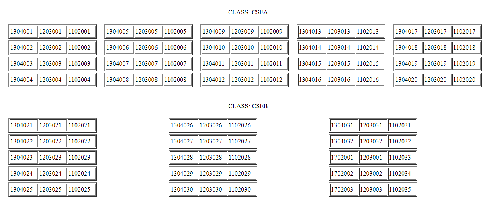

# Seating-Arrangement-Generator
A web-based seating arrangement generator app made in PHP for generating seating layouts in classrooms and examination halls. Handy for teachers and examination organizers to quickly generate seating layouts. The application can generate layouts for any number of rooms and lists of students.

How it works
------------
<ul>
 <li>The list of rooms available along with the number of rows and columns of benches is listed in <i>rooms.txt</i>.</li>
 <li>For each list of students to be seated, a textfile containing their roll numbers is created.</li>
 <li>On running <i>index.php</i>, each list of students are allotted seats parallel to other lists in the rooms available.</li>
 <li>The layout can be printed and displayed outside the examination hall.</li>
</ul>

Pre-requisites
--------------
<ul>
 <li>PHP</li>
 <li>Apache</li>
</ul>

Deployment
----------
<ul>
 <li>Setup the Apache server through XAMPP or a distribution software of your choice.</li>
 <li>Start the web server.</li>
 <li>Clone the project to your web server's default path.</li>
 <li>Run the app on your web browser at localhost/path/sage/index.php, where path is the path to the project's directory.</li>
 <li>The generated layouts will be displayed.</li>
</ul>

Screenshots
-----------

  
